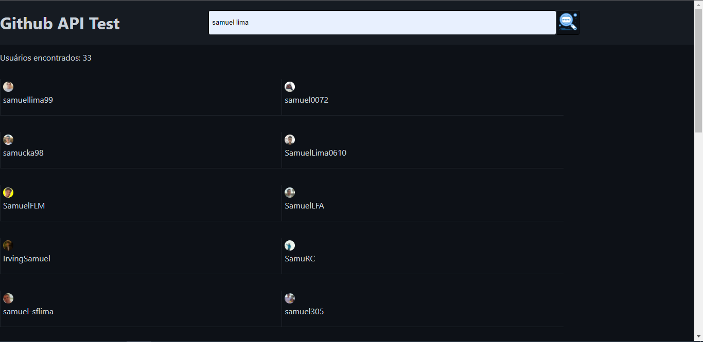
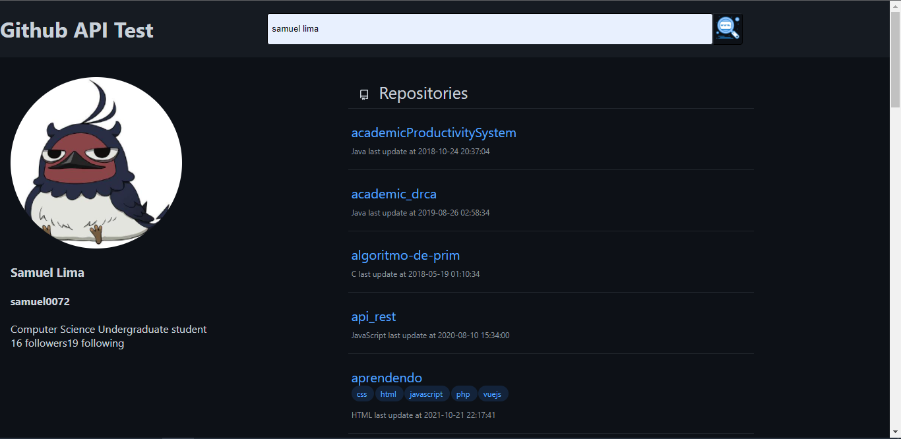

# php_test
Repositório para implemtação de um teste em PHP. 

O objetivo é utilizar a API pública do Github e implementar o uso de algumas de suas funções em PHP.

## Instalação

Para instalar, realize os seguintes passos:

1. Instale o [Xampp](https://www.apachefriends.org/pt_br/download.html).
2. Instale o [Composer](https://getcomposer.org/download/).
3. Adicione o composer às variaveis de ambiente do seu sistema operacional.
3. No diretório `PASTA/DE/INSTALAÇÃO/DO/XAMPP/htdocs`, clone este repositório.
4. No diretório raíz desse repositório, execute o comando `composer install`.

## Uso

Para utilizar, realize os seguintes passos:

1. Inicie o XAMPP Control Panel.
2. Inicie o módulo Apache. Verifique em quais portas o Apache irá executar.
3. No seu navegador, acesse http://localhost:PORTA_DE_ESCUTA/php_test/

## Observações
- A API do Github utilizada só permite 50 requisições não autenticadas por hora. Tenha isso em mente.

## Capturas de tela

